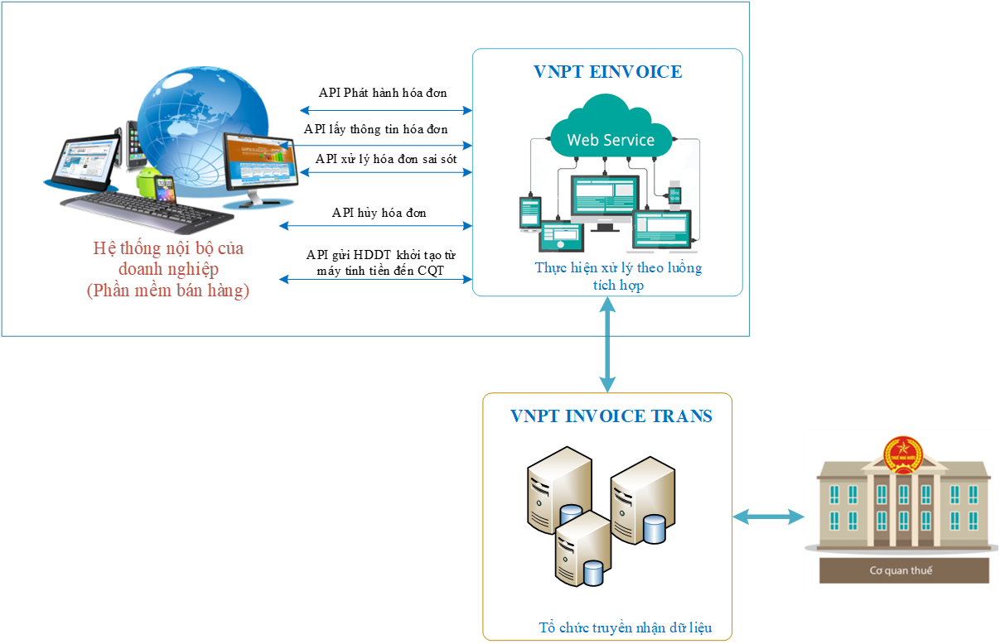

# 1.Mô hình và nghiệp vụ

Dưới đây là sơ đồ mô hình tích hợp Dịch vụ **HDDT MTT** với phần mềm **Bán hàng, MTT**:


## Mô hình tích hợp 

Dưới đây là sơ đồ, mô hình tích hợp HDDT Máy tính tiền với phần mềm bán hàng, máy tính tiền




## Nghiệp vụ HDDT MTT cần tích hợp 

Để đảm bảo đồng bộ dữ liệu, khuyến nghị đối tác tích hợp đủ các nghiệp vụ sau:

```jsx title="Danh sách nghiệp vụ HDDT MTT quan trọng"
1. Nghiệp vụ insert/update khách hàng
2. Nghiệp vụ phát hành hóa đơn
3. Nghiệp vụ lấy thông tin hóa đơn
4. Nghiệp vụ hủy hóa đơn
5. Nghiệp vụ điều chỉnh hóa đơn
```